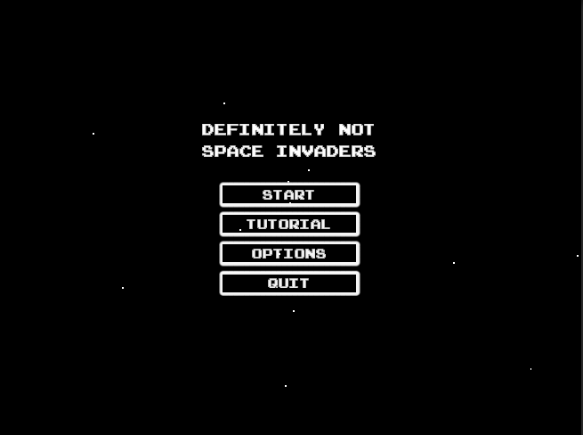
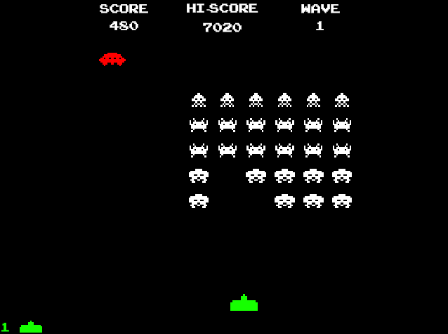

# Definitely Not Space Invaders

Clone of Space Invaders without player bunkers (for now). Developed using the Unity game engine with borrowed assets.  

[Download from here](https://github.com/wukelang/SpaceInvaders/releases)

[itch.io page](https://langdev.itch.io/dnsi)

## Controls
- Left/Right : move cannon  
- Space: shoot missile  
- Esc: pause menu  

## Screenshots

## Acknowledgements

https://www.classicgaming.cc/classics/space-invaders/ - Sprite assets and SFX